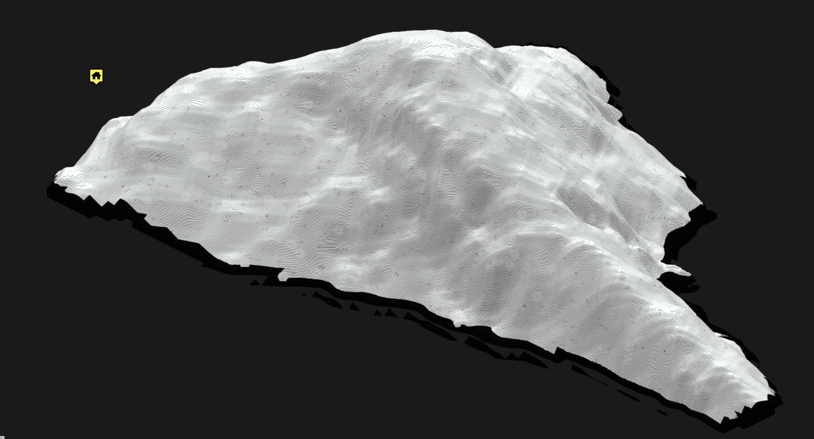
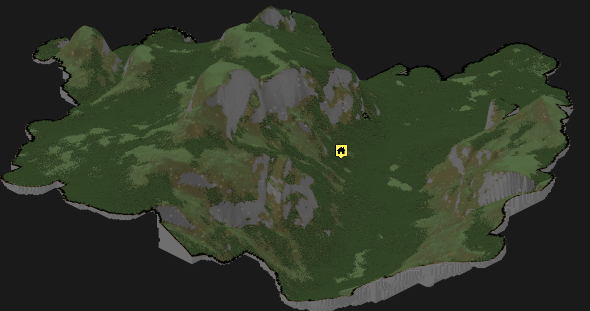
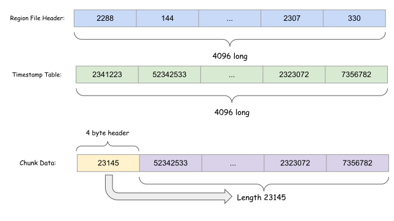
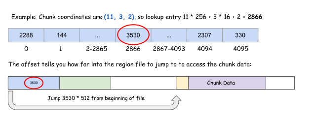
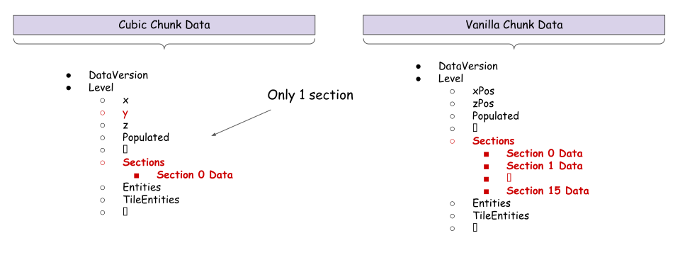

### Minecraft (Cubic Chunks) Overviewer 

Disclaimer: This program was inspired by Andrew Brown and contributors (see CONTRIBUTORS.rst). All the links to their original minecraft overviewer program can be found below. All I did was modify it to make it compatible with the cubic chunks format to make it possible to render arbitrarily tall worlds.

Documentation:
    http://docs.overviewer.org

Github code repository:
    https://github.com/overviewer/Minecraft-Overviewer

Travis-CI:
    https://travis-ci.org/overviewer/Minecraft-Overviewer

Blog:
    https://overviewer.org/blog/


Some example renders:


Mount Everest


Half Dome, California


Grand Canyon, Arizona

You can find how the overviewer works at a high level by reading the documentation found above. I am putting the format of cubic chunks here (to the best of my knowledge) to hopefully save people some time, since I couldn't find any documentation on it online.

Cubic Chunk data is stored in .2dr and .3dr region files. The important information for this overviewer program is mostly in the .3dr files. These files are named in the following format:

`chunkx.chunky.chunkz.3dr`

The chunkx, chunky, and chunkz are region coordinates. Each cubic chunk region contains information about a 16x16 grid of chunks, each of which is 256 tall. Note than in vanilla, the region files store information about a 32x32 grid of chunks 256 tall, which is different! Each .3dr file can be viewed as a long sequence of bytes that looks like this:


There can be up to 4096 chunk data (yellow and purple segments) in a region file. Each region file will only have 1 header (blue) at the very beginning, followed immediately by a timestamp table (green). A more detailed view of each component in the region file is shown here:



* The Chunk Data is comprised of 4-byte header, followed by its actual data. The chunk data header is just a number representing how long the chunk data is. Note, this is different from the vanilla chunk format. In vanilla, the chunk data header uses the first 4 bytes to encode the length of the chunk, and uses an byte to encode the compression type. Since cubic chunks always use GZip compression, there is no need for this byte.
* The timestamp table seems to be similar to the vanilla time stamp table, except it is 4 times as long. A cubic chunk region file stores data for 4096 different chunk **sections**, while vanilla stores data for 1024 **chunks**, each of which contains between 0-16 chunk sections
* The Header consists of 4096 4-byte long sections. Each 4-byte section contains information about the location of chunk data. The first 3-bytes of the section represent the global offset to get to the chunk data, while the last byte says how long the chunk data is. An example of how to access chunk data given x,y,z coordinates is shown in the following picture:



To get the overviewer to read cubic chunks, we need to understand the difference between cubic chunk data format, and vanilla chunk data format. The differences relevant for the overviewer are shown below:



The critical difference is that **cubic chunk data only stores data for 1 section**. Since there is only 1 section, its y-coordinate is stored as a separate field. Vanilla chunks instead store chunk data for up to 16 chunk sections in its section tag. Each section within the section tag also has its y-coordinate encoded in it, instead of having it on the outside like the cubic chunks format.


### How to use:
* Clone the repository, or download the repository and extract its contents to a new folder.
* Follow the instructions from [the overviewer](http://docs.overviewer.org/en/latest/building/) to build from source for your operating system. Do not download their most recent source code though, instead use the contents from this repository. 
* Create a config file named `config` in the same folder that has `overviewer.py`. An example config file is shown below:

```
worlds["My world"] = "<Put path to world folder here>"

renders["normalrender"] = {
    "world": "My world",
    "title": "Half Dome Section",
    "northdirection": "upper-right",
    
    # Remove the hashtag on line below if you want to render a section of your world. Format is (xmin, zmin, xmax, zmax)
    #"BTEcrop": (5711300,-12494310, 5711400, -12494110),
    "rendermode":smooth_lighting
}

outputdir = "./outputs"
```
* Navigate to the folder containing `overviewer.py`, and run
```
python overviewer.py --config=config --forcerender
```

### Bug fixing TODOs:
* Random patches of non-smooth light areas when using smooth lighting
* --check-tiles mode doesn't work, must use --force-render to render entire desired section